# E-commerce Platform Deployment on AWS EC2

## Table of Contents

1. [Introduction](#introduction)
2. [Git Version Control Setup](#1-git-version-control-setup)
   - [Initialize Git Repository](#11-initialize-git-repository)
   - [Obtain and Prepare the E-Commerce Website Template](#12-obtain-and-prepare-the-e-commerce-website-template)
   - [Stage and Commit the Template to Git](#13-stage-and-commit-the-template-to-git)
   - [Push the Code to Your GitHub Repository](#14-push-the-code-to-your-github-repository)
3. [AWS Deployment](#2-aws-deployment)
   - [Set Up an AWS EC2 Instance](#21-set-up-an-aws-ec2-instance)
   - [Clone the Repository on the Linux Server](#22-clone-the-repository-on-the-linux-server)
   - [Install a Web Server on Linux Server (EC2)](#23-install-a-web-server-on-linux-server-ec2)
   - [Configure httpd for Website](#24-configure-httpd-for-website)
   - [Access Website from Browser](#25-access-website-from-browser)
4. [Continuous Integration and Deployment Workflow](#3-continuous-integration-and-deployment-workflow)
5. [Troubleshooting](#4-troubleshooting)

## Introduction

This project demonstrates the deployment process of an e-commerce platform, **MarketPeak**, while showcasing how I, as a DevOps engineer, collaborate with developers to achieve continuous integration and deployment. For the initial deployment, I am using the [Little Fashion HTML Template](https://www.tooplate.com/view/2127-little-fashion) as the foundation for the website's frontend design. In a real DevOps operation, this process would be fully automated using CI/CD pipelines. However, for the sake of demonstration, I will be performing these steps manually to showcase how the process works under the hood. Future projects will take full advantage of automated DevOps CI/CD workflows to streamline and enhance the deployment process.

## 1. Git Version Control Setup

### 1.1. Initialize Git Repository
- Create a directory named `MarketPeak_Ecommerce`.
- Initialize a Git repository to manage version control.

    ```bash
    mkdir MarketPeak_Ecommerce
    cd MarketPeak_Ecommerce
    git init
    ```

    

### 1.2. Obtain and Prepare the E-Commerce Website Template

- Download a suitable e-commerce website template from [link to choose from](https://www.tooplate.com/view/2127-little-fashion).

    

- Extract the downloaded template into your project directory, `MarketPeak_Ecommerce`.

    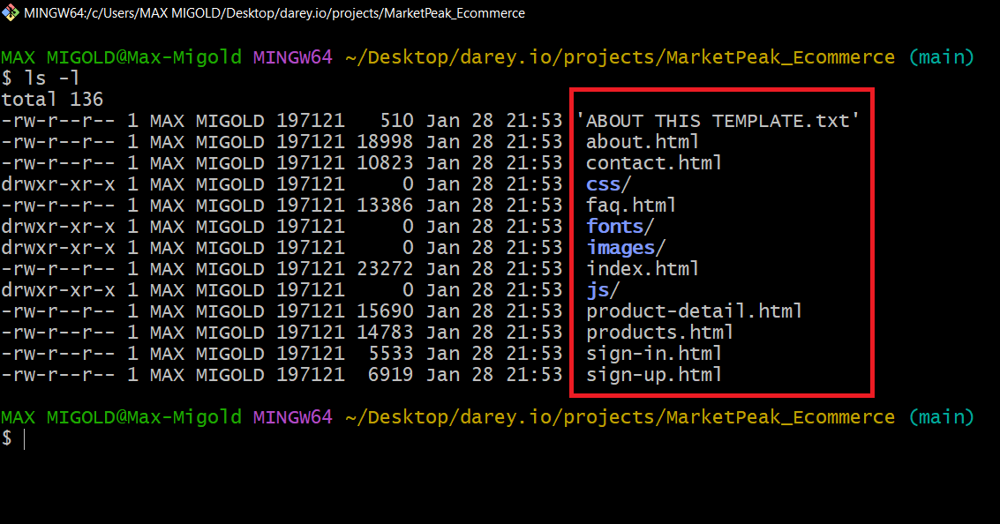

### 1.3. Stage and Commit the Template to Git

- Add your website files to the Git repository.

    > *If this is the first time of using git on the system, you will need to set the global configuration with your name and email before initiating the commit command. see the code for setting your global configuration for git:*
    >    ```bash
    >    git config --global user.name "Your name e.g John Doe"
    >    git config --global user.email "youremail@example.com"
    >   ```

- Commit your changes with a clear, descriptive message.

    ```bash
    git add .
    git commit -m "Initial commit with basic e-commerce site structure"
    ```

    

### 1.4. Push the code to your Github repository

- Create a remote repository on GitHub named **MarketPeak_Ecommerce.**

    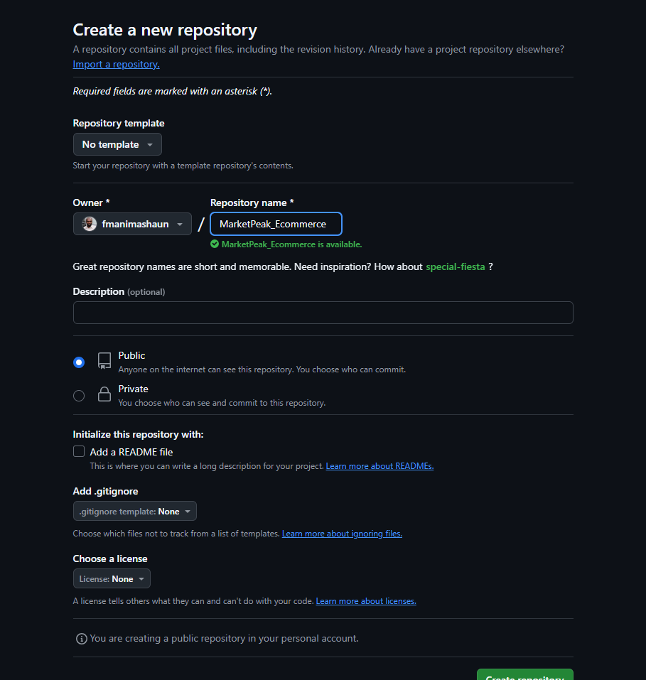

- Link your local repository to GitHub and push your code.

    ```bash
    git remote add origin https://github.com/fmanimashaun/MarketPeak_Ecommerce.git
    git branch -M main
    git push -u origin main
    ```

    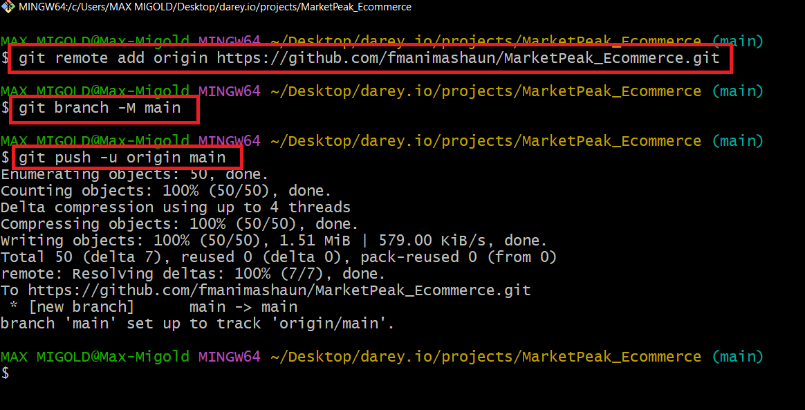

## 2. AWS Deployment

### 2.1. Set Up an AWS EC2 Instance

- Log in to the AWS Management Console

    

- Launch on EC2 instance using Amazon Linus AMI

    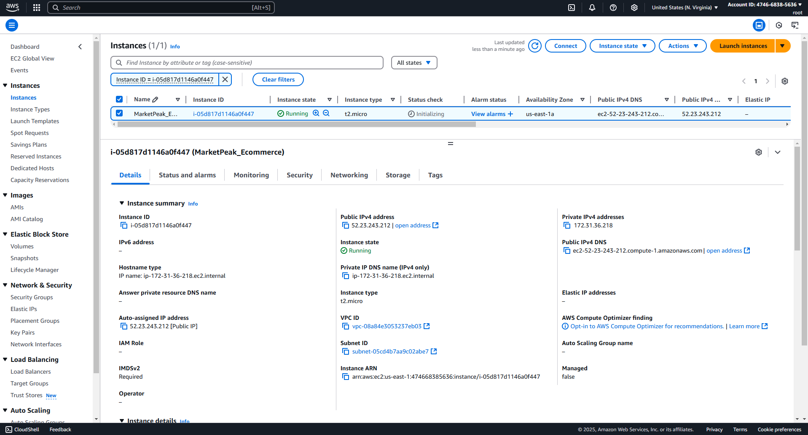

- Connect to the instance using SSH.

    - Install `remote-ssh` extention on your vscode

        

    - Click the bottom left corner of the vsode to open the `remote window`

        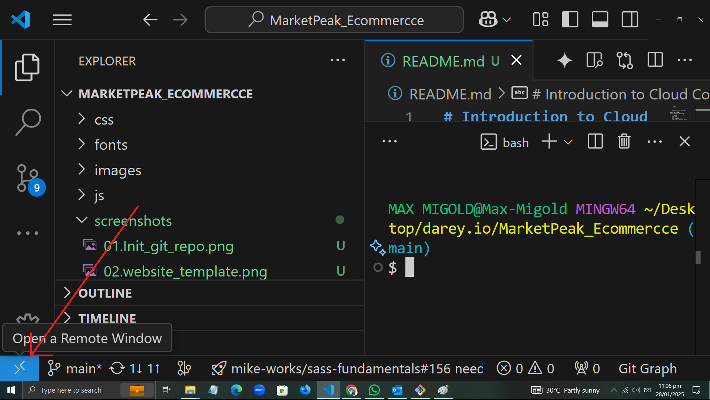

    - select `Connect to host...`

        

    - Select `Configure SSH host...`

        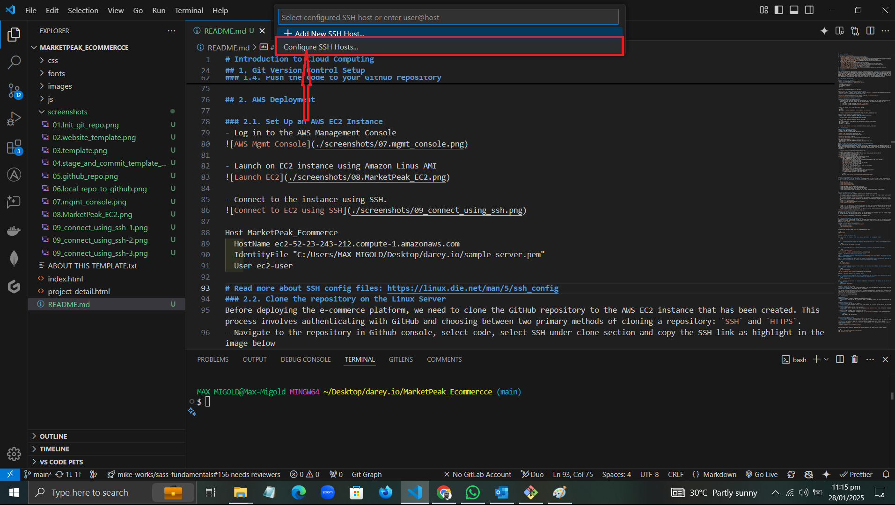

    - Select the path to your `.ssh/config` file

        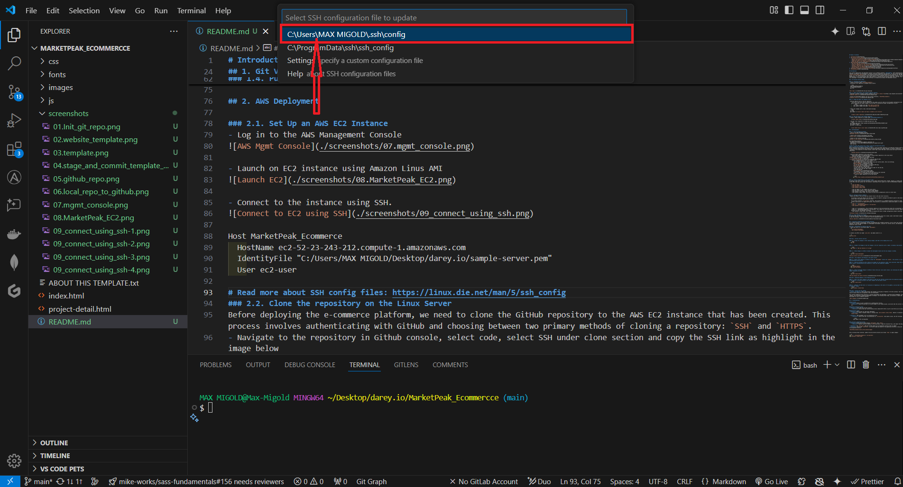

    - Paste your EC2 ssh configuration as shown below and close the file

        ```bash
        Host MarketPeak_Ecommerce
            HostName <Public IPv4 DNS of your EC2 instance>
            IdentityFile "<path to your key pair>"
            User ec2-user
        ```
   
        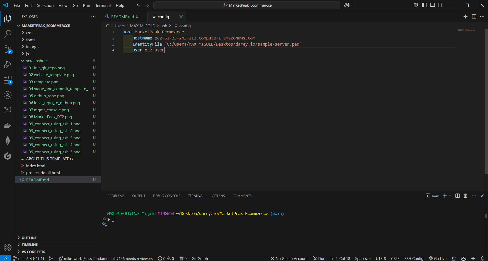

    - Run the ssh connection command below in your vscode terminal to connect to EC2
        ```bash
        ssh MarketPeak_Ecommerce
        ```
        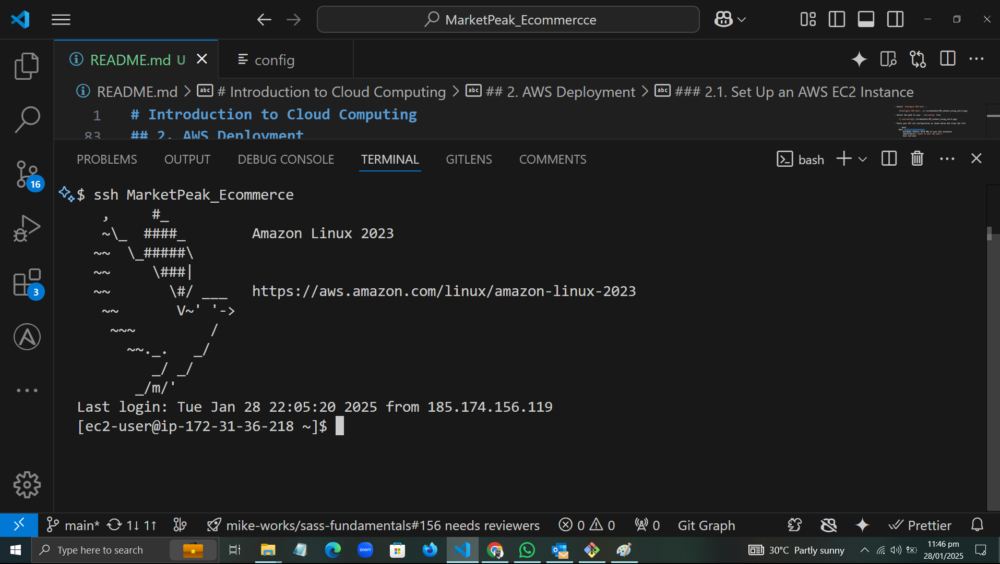

        >Read more about SSH config files: https://linux.die.net/man/5/ssh_config

### 2.2. Clone the repository on the Linux Server

Before deploying the e-commerce platform, the first step is to clone the GitHub repository onto the newly created AWS EC2 instance. This requires authenticating with GitHub and selecting a cloning method. It’s highly recommended to use the SSH method for secure and seamless authentication, as it eliminates the need to enter credentials repeatedly. Alternatively, the HTTPS method can be used, but it requires entering a username and personal access token for authentication.

- Navigate to the repository in Github console, select code, select SSH under clone section and copy the SSH link as highlight in the image below

    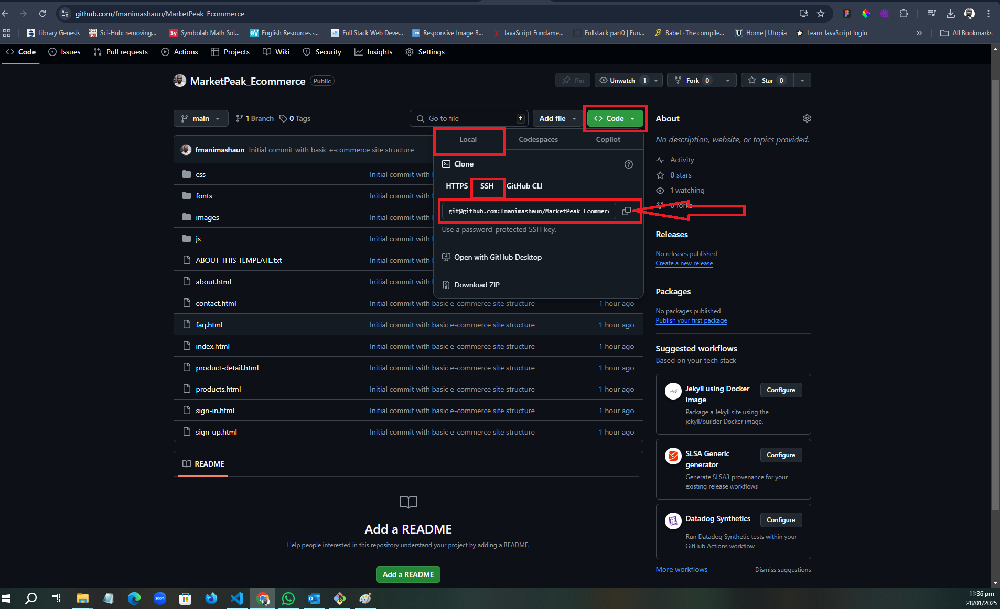

- Clone the remote repository on the Linux Server

    - Below tasks need to be completed before cloning remote repository on the Linux Server

    - Generate SSH keypair using ssh-keygen

        ```bash
        ssh-keygen
        ```
        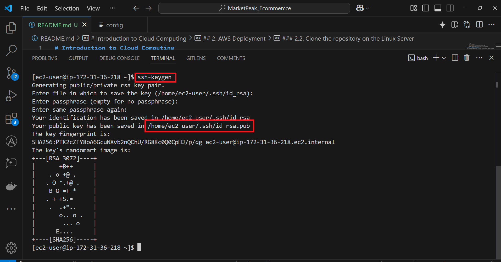

    - To display and copy our public key

        

    - add the copied SSH public key to our GitHub account

        - Go to GitHub and log in to your account.

        - In the upper-right corner of any page, click your `profile photo`, then click `Settings`.

            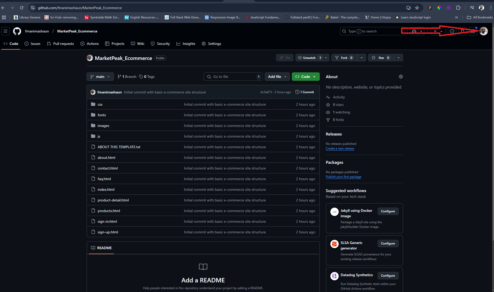
            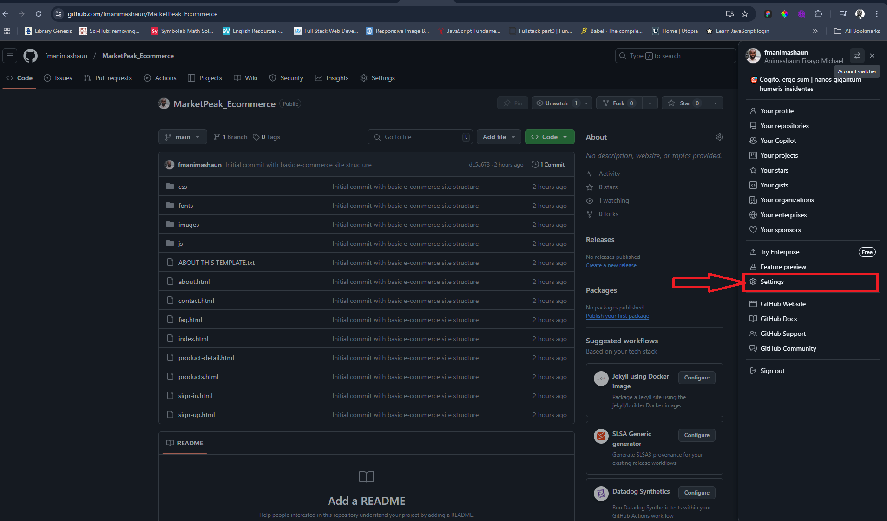

        - In the user settings sidebar, click `SSH and GPG keys`.

            

        - Click New SSH key or Add SSH key.

            

        - In the "Title" field, add a descriptive label for the new key.

        - Paste your key into the "Key" field.

        - Click Add SSH key.

            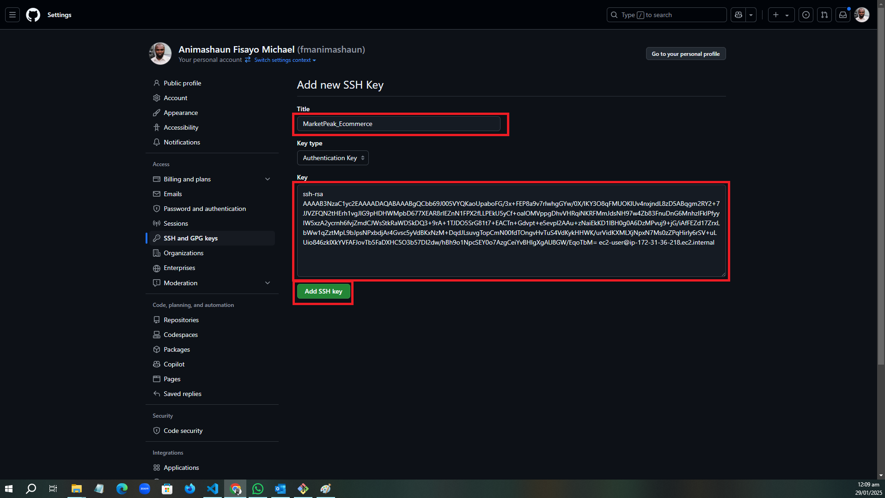

        - If prompted, confirm your GitHub password.

        - On the EC2 terminal, Test the SSH connection to GitHub using the following command:

            ```bash
            ssh -T git@github.com
            ```
            > Hi <your-github-username>! You've successfully authenticated, but GitHub does not provide shell access.

            

        - On the EC2, install git:

            ```bash
            sudo dnf update -y
            sudo dnf install git
            ```

            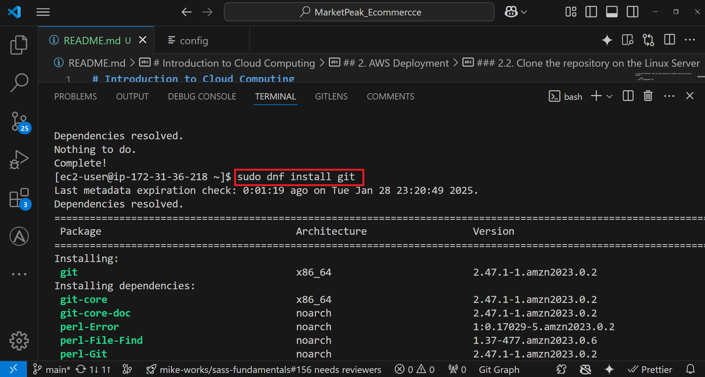

         - Clone our remote repository on the Linux Server

            ```bash
            git clone git@github.com:fmanimashaun/MarketPeak_Ecommerce.git
            ```
             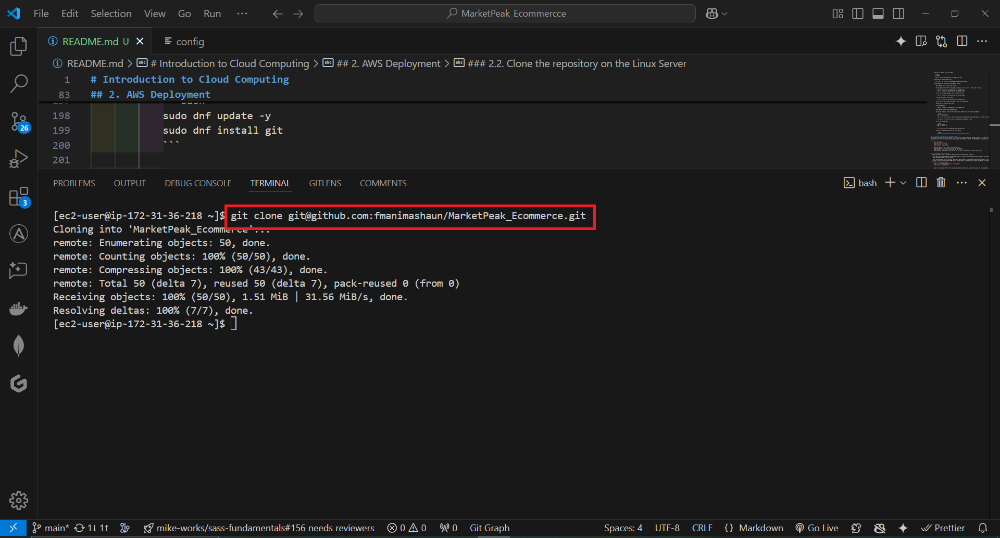

### 2.3. Install a Web Server on Linux Server (EC2)
To install a web server on the EC2 instance, we will install `Apache HTTP Server (httpd)` web server. Apache is a widely used web server that serves HTML files and content over the internet. Installing it will enable us to host the MarketPeak e-commerce site.

```bash
sudo dnf update -y
sudo dnf install httpd -y
sudo systemctl start httpd
sudo systemctl enable httpd
sudo systemctl status httpd
```
>- sudo dnf update -y: This updates the Linux server.
>- sudo dnf install httpd -y: This installs httpd (Apache).
>- sudo systemctl start httpd: This starts the web server.
>- sudo systemctl enable httpd: This ensures the web server automatically starts on server boot.
>- sudo systemctl status httpd: To check the status of the apache web server

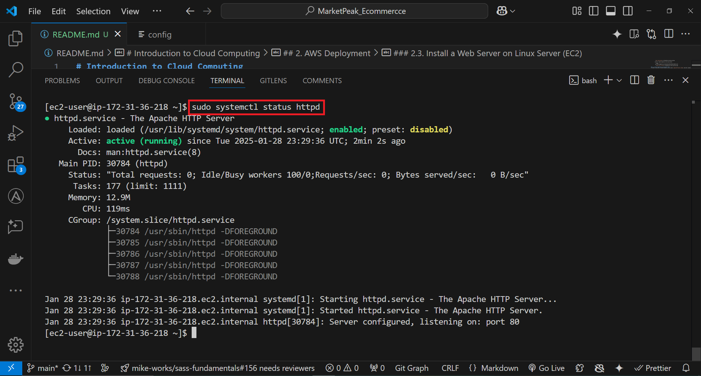

### 2.4. Configure httpd for Website
- Remove any default files and copy your project files to the web server directory.

    To be able to serve the website from the EC2 instance, we need to configure the httpd to point to the directory on the linux server where the website code files are stored.

    It is usually stored in `var/www/html` directory. This directory is a standard directory structure on Linux systems that host web content, particularly for Apache HTTP Server. Thus directory is automatically created when Apache is installed on the system.

    ```bash
    sudo rm -rf /var/www/html/*
    sudo rsync -av /home/ec2-user/MarketPeak_Ecommerce/ /var/www/html/
    sudo systemctl reload httpd
    sudo rm -rf MarketPeak_Ecommerce/
    ```

    >- `sudo rm -rf /var/www/html/*`: This forcefully removes all files and directories within the /var/www/html/ directory.
    >- `sudo rsync -av /home/ec2-user/MarketPeak_Ecommerce/ /var/www/html/`: copy file to `/var/www/html/` while preserving file structure:
    >    - **`-a`**: Archives the files, preserving structure and attributes.
    >    - **`-v`**: Provides verbose output, showing which files are being synced.
    >- `sudo systemctl reload httpd`: This reloads the Apache HTTP Server (httpd) configuration without restarting the service.
    >- `sudo rm -rf MarketPeak_Ecommerce/`: delete the clone repo from the remote server

### 2.5. Access Website from Browser
To confirm that our Server is configured properly and the website files are in place, open a web browser using the Public IP address of your EC2 instance `http://<public IP of EC2 instance>/`. This will allow you to view the deployed website.


## 3. Continuous Integration and Deployment Workflow
For an efficient and smooth workflow in developing, testing, and deploying the e-commerce platform, we will follow a structured approach. This includes working in a local development environment, using Git for version control, and deploying updates to the production server on AWS.

### Step 1. Developing new features and fixes

In a real software development process, it’s essential to avoid editing files directly on the live production server. All changes are made in the local development environment before they are committed and pushed to the remote repository. As such, we are going to open the local repo on our local machine via vscode.

- **Create and switch to a new branch named `development`:**
   Open the terminal in VSCode and use the following command to create and switch to a new branch:
    ```bash 
    git checkout -b development
    ```

- **Update the `index.html` file:**
After switching to the `development` branch, open the `index.html` file in VSCode and make the necessary changes.

    For example, change the hero section `on line 100`

    Before:
    ```html
    <h1 class="slick-title">Cool Fashion</h1>
    ```

    After:
    ```html
    <h1 class="slick-title">This was changed to demonstrate CI/CD flow</h1>
    ```

   Save the file after editing.

### Step 2. Version Control with Git

#### 2.1. **Stage the Changes:**
   Once you’ve made changes to the `index.html` file, stage the changes to Git using:
   ```bash
   git add index.html
   ```

#### 2.2. **Commit the Changes:**
   Commit the staged changes with a meaningful message that explains the change:
   ```bash
   git commit -m "Update hero section text to demonstrate CI/CD flow"
   ```

#### 2.3. **Push Changes to GitHub:**
   After committing the changes locally, push the `development` branch to GitHub:
   ```bash
   git push origin development
   ```

### Step 3. Pull Requests and Merging to the `main` Branch

#### 3.1. **Create a Pull Request on GitHub:**
   Go to GitHub and create a Pull Request (PR) to merge the `development` branch into the `main` branch. This allows for code review and ensures the changes are properly vetted before they make it to production.

#### 3.2. **Review and Merge the Pull Request:**
   Review the changes on GitHub, and once everything is satisfactory, merge the PR into the `main` branch.

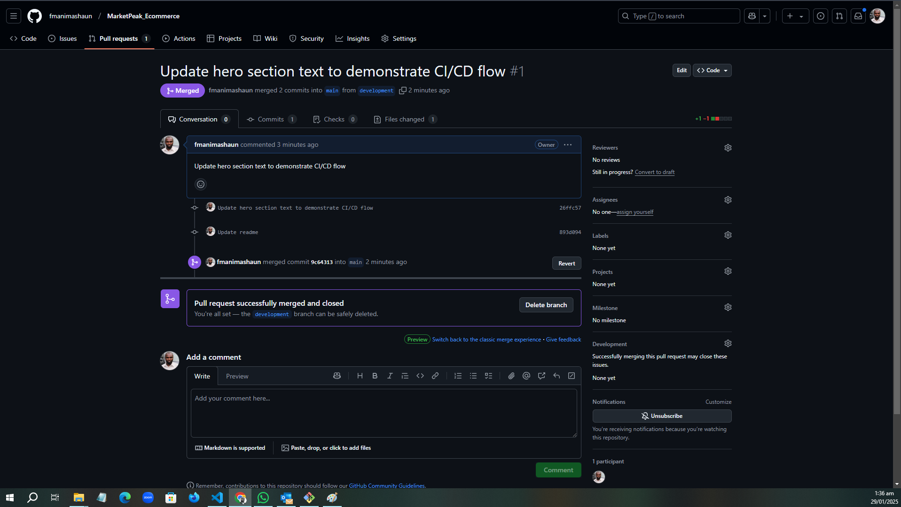

### Step 4. Deploying Updates to the Production Server (Using VSCode Remote SSH)

#### 4.1. **SSH into the EC2 Instance Using VSCode Remote SSH:**
   In your VSCode terminal, connect to the remote server using the SSH configuration you've set up (`MarketPeak_Ecommerce`):

   ```bash
   ssh MarketPeak_Ecommerce
   ```

#### 4.2. **Navigate to the Repository Directory on the Remote Server:**
   After connecting to the remote server using `ssh MarketPeak_Ecommerce`, navigate directly to the deployment directory where the repository resides (/var/www/html/). Since we've already synced the contents of the cloned repository to this directory, we can update the code directly there:

   ```bash
   cd /var/www/html/
   ```

#### 4.3. **Pull the Latest Changes from the `main` Branch:**
   Once inside the `/var/www/html` directory, use `git pull origin main` to fetch and merge the latest updates from the main branch of the repository:

   ```bash
   git pull origin main
   ```

#### 4.4. **Restart the Web Server to Apply Changes:**
   Once the changes have been synced, reload or restart the web server to apply them. For an Apache web server, use:

   ```bash
   sudo systemctl reload httpd
   ```

### Step 5. Testing the new changes
- **Access the Website:** Open a web browser and navigate to the public IP address of the EC2 instance `http://<public IP of EC2 instance>/`. Test the new features or fixes to ensure they work as expected in the live environment.

This workflow emphasizes best practices in software development and deployment, including branch management, code review through pull requests, and continuous integration/deployment strategies. By following these steps, you maintain a stable and up-to-date production environment for your e-commerce platform.


## 6. Troubleshooting

### Git Issues

- **Problem:** Unable to push to GitHub due to authentication failure.

    - **Solution:** Ensure the SSH key is correctly added to your GitHub account, and verify that the correct remote URL is set in Git.

### AWS EC2 Connection Issues

- **Problem:** Cannot SSH into the EC2 instance.

    - **Solution:** Verify that your security group allows inbound SSH traffic on port 22 and that you are using the correct key pair.

### Web Server Issues

- **Problem:** Website does not load after deployment.

    - **Solution:** Check if Apache (httpd) is running using `sudo systemctl status httpd`. Restart if necessary with `sudo systemctl restart httpd`.
    - **Solution:** refresh the browser

- **Problem:** "403 Forbidden" error on accessing the site.

    - **Solution:** Ensure that your file permissions in `/var/www/html` allow public access. Use the following command:

        ```bash
        sudo chmod -R 755 /var/www/html
        ```
